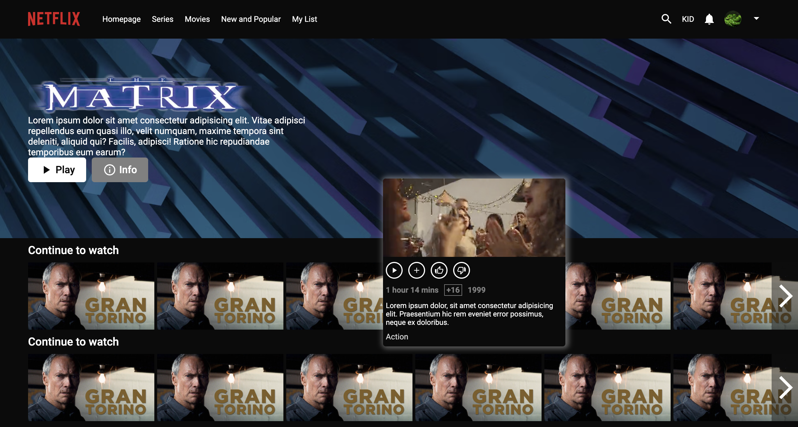

# React Netflix clone

## Description 
Movie website front-end part created with React hooks

## Built with
HTML5
CSS
SCSS 
React

## Developer experience 
- learned and practiced some core React concepts, such as re-renders, state management, and breaking down your code into components.

## Features
- 3 pages: registration page, login page, and main page;
registration and login pages:
    - login/registration form, image background
main page:
    2 menus pinned to the top of the page:
    - navigation menu at the top left;
    - profile menu and search at the top right;
    - hero page with movie title, description, and background image;
    - "play movie" and "info" buttons
    - "continue to watch" slots, with complex hover animation:
        - fragment of the movie
        - description
        - genre bar
        - episode length
        - age rating
        - year of production
        - "play", "add to queue", "like", "dislike" buttons
        all embedded into the hover animation     
        the slots are also side-scrollable

## Register page

## Login page

## Home page

## Home page with hover animations displaying video
